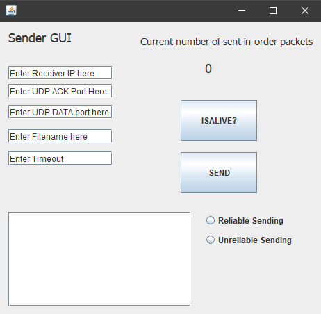

# File-Transfer-Protocol
Reliable file transfer protocol implmented on top of Java's **DatagramSocket** API.

## Protocol
Both sender and receiver applications utilize **Stop and Wait** protocol.

## Sender Application
Located in the Sender file structure, the Sender application has a basic GUI made in **Swing**.

### Arguments
* Receiving application's IPv4 address
* UDP port number to be used for acknowledgements
* UDP port number to be used for sending data
* Name of file to be sent to receiving application (.txt file)
* Timeout (in μs) - how long the Sender will wait for an acknowledgement for a packet before resending it
* Reliable/Unreliable Sending radio buttons:
  * If "Reliable Sending" or none of the buttons is clicked, the Sender will send reliably (i.e no packet loss)
  * If "Unreliable Sending" is clicked, the Sender will simulate packet loss by "dropping" every 10th packet

### Other GUI Components
* Current number of sent in-order packets counter:
  * Counter that updates whenever a packet is successfully sent to the receiving application
* Textbox in the bottom left:
  * Status box that displays the results of the Sender's actions when either "ISALIVE?" or "SEND" is pressed
